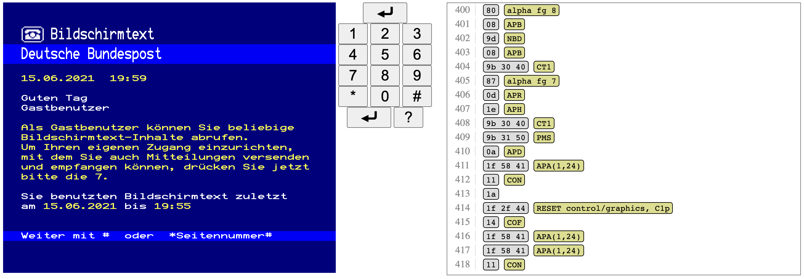

# cept.js

A terminal emulator compliant with ETS 300 072



## Running The Local Webserver

```
pipenv --python 3
pipenv install
pipenv run ./devserver.py
```

The standard terminal is available as [localhost:8080/web/index.html](http://localhost:8080/web/index.html).

A testing setup is available at [localhost:8080/web/testing.html](http://localhost:8080/web/testing.html).

## Fonts

[European Teletext](https://notabug.org/HarvettFox96) is CC0 licensed by Jayvee Enaguas.

[ModeSeven](https://dev.null.org/fonts/) by Andrew Bulhak: "This font is freely distributable."

[Galax Teletext](https://galax.xyz/TELETEXT/) has a custom license: "This font is free to use in non-commercial projects. I would appreciate a credit and notification that you are using it."

[Fairfax HD](https://www.kreativekorp.com/software/fonts/fairfaxhd.shtml)  by KreativeCorp is licensed under the OFL.

## See also

[Teletext Character Set](https://en.wikipedia.org/wiki/Teletext_character_set) is a different (newer) standard that has many of the same characters, but with different code points.
